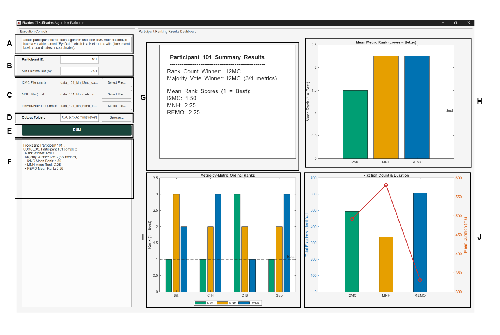

# Evaluating Fixation Classification Algorithms in Motor Control: Downstream Impacts on Behavioral Metrics

#### This is the repository accompanying [insert citation]. 

## Repository Overview:
* **algo_ranking folder**: contains the GUI wrapper and function to run single-participant fixation data through cluster metric evaluation. 
* **analysis folder**: contains the custom code used in the paper's analysis.
* **docs folder**: contains documentation for both algo_ranking and analysis code.
* **example_data folder**: contains example data files for input to the algo_ranking GUI.
* **external_modifications**: contains the external code files modified for the paper's analysis.

---

### Quick Guide to the Fixation Classification Algorithm Evaluator GUI (`gui_single_ranking_pipeline`)

This tool provides a graphical user interface for running single-participant fixation data through cluster metrics evaluation (Silhouette, Calinski-Harabasz, Davies-Bouldin, and Gap Statistic) and automatically ranks the classification algorithms. Please note we have tested this code only on our dataset (collected with a Tobii ProFusion, sampled at 120 Hz).

---

#### Annotated UI Layout & Workflow



##### Component Reference

| Identifier | UI Element | Function |
| :--- | :--- | :--- |
| **[A]** | Text Area | Displays required matrix variables (`eyeData`) and formatting instructions. |
| **[B]** | Numeric Fields | Edits numeric `Participant ID` and `Min Fixation Duration (s)`. |
| **[C]** | File Pickers | Browses and loads algorithm-specific `.mat` event classification files. |
| **[D]** | Directory Picker | Configures output folder path for saving analysis results. |
| **[E]** | Button | Triggers ranking pipeline execution and disables inputs during calculation. |
| **[F]** | Log | Console streaming real-time status, metric summaries, and warnings. |
| **[G]** | Dashboard Tile 1 | Displays text summary of overall rank and majority vote winners. |
| **[H]** | Dashboard Tile 2 | Bar plot rendering mean metric ranks across evaluated algorithms. |
| **[I]** | Dashboard Tile 3 | Grouped bar plot detailing metric-by-metric ordinal ranks. |
| **[J]** | Dashboard Tile 4 | Dual-axis plot comparing total fixation counts and mean durations. |

---

#### Determining Rank Winner

The primary evaluation criterion is the Borda Count, represented by `mean_ranks = mean(ranks, 2)`. The algorithm with the lowest mean rank is selected as `borda_winner`. 

In the event of a tie in mean ranks, the tie is broken using the following strict hierarchy:

```
                  +-----------------------------------+
                  |      Evaluate Mean Ranks          |
                  +-----------------------------------+
                                    |
                        Is min mean rank unique?
                        /                      \
                       /                        \
                     YES!                       NO...
                     /                            \
        +-------------------------+    +----------------------------------+
        | Declare Winner          |    | Stage 1 Tie-Break:               |
        +-------------------------+    | Compare 1st-Place Win Counts     |
                                       +----------------------------------+
                                                        |
                                          Is highest win count unique?
                                          /                        \
                                       YES!                         NO...
                                        /                            \
                           +-------------------------+  +-------------------------------+
                           | Declare Winner          |  | Stage 2 Tie-Break:            |
                           +-------------------------+  | Compare Relative Gap          |
                                                        | Statistic Score               |
                                                        +-------------------------------+
                                                                        |
                                                        +-------------------------------+
                                                        | Declare Winner                |
                                                        +-------------------------------+
```

1. **Stage 1 (Primary Score)**: Select algorithm(s) with the minimum `mean_ranks`.
2. **Stage 2 (First-Place Wins)**: If multiple algorithms share the minimum mean rank, select the algorithm with the highest number of 1st-place metric ranks (`first_place_wins`).
3. **Stage 3 (Gap Statistic Priority)**: If a tie still persists, select the candidate with the highest raw Gap Statistic value (`metrics.gap`) among the remaining tied algorithms.

---

#### Dependencies
* Statistics and Machine Learning Toolbox
* Parallel Computing Toolbox
* Image Processing Toolbox

| MATLAB Toolbox | Required for |
| :--- | :--- | 
| Statistics and Machine Learning | evalclusters, pdist2, accumarray, grp2idx |
| Parallel Computing | gcp, parpool, parfeval, parallel.FevalFuture, fetchOutputs |
| Image Processing | bwlabel |

---

#### Expected Input/Output

##### Input File

* **File Type:** MATLAB Data (`.mat`)
* **Required Variable Name:** `eyeData`
* **Matrix Structure:** N x 4 numeric matrix (where N is total sample count)

| Column Index | Variable | Data Type | Description |
| :--- | :--- | :--- | :--- |
| **1** | Timestamps | `double` | Sample timestamps in seconds |
| **2** | Event Label | `double` / `integer` | Classification label (`1` = Fixation, `2` or other = Saccade / Pursuit / Noise / any non-Fixation event) |
| **3** | X Coordinates | `double` | Horizontal gaze position (cm) |
| **4** | Y Coordinates | `double` | Vertical gaze position (cm) |

---

##### Output File

* **Saved Location:** `<Output Folder>/algoEval_<subjectID>_results.mat`
* **Saved Structure:** `results`

```matlab
results = 
        subjectID: 101
            algos: {'i2mc', 'mnh', 'remo'}
          metrics: [1x1 struct]  % s, db, ch, gap, numFixations, meanFixDur
            ranks: [3x4 double]  % Ordinal ranks across 4 metrics
       mean_ranks: [1x3 double]  % Mean rank per algorithm
     borda_winner: 'i2mc'        % Rank count overall winner
  majority_winner: 'i2mc'        % Majority vote winner
         max_wins: 3             % Count of metric first-place finishes
```

---

#### Default Parameters Table

| Parameter Field | Default Value | Allowed Range / Type | When to Alter |
| :--- | :--- | :--- | :--- |
| **Participant ID** | `101` | Integer (> 0) | Set to match the current participant. |
| **Min Fixation Dur (s)** | `0.04` (40 ms) | Numeric | Modify as needed. |
| **Sampling Frequency** | `120` Hz | Fixed numeric (> 0) | Eye tracker sampling rate in Hz (`cfg.samplingFreq`). Modify in code as needed. |
| **Gap Stat Reps (`B`)** | `25` | Integer (10 to 100) | Internal configuration for parallel processing (`cfg.B_per_worker`). Increase for quality; decrease for fast GUI testing. |
| **Output Folder** | `./output` | Valid path string | Change to save outputs to an external drive or root project directory. |

#### Further Information
More detailed documentation is available in the docs folder. Please see:
* docs/gui_single_ranking_pipeline.md
* docs/run_single_ranking_pipeline.md
---
