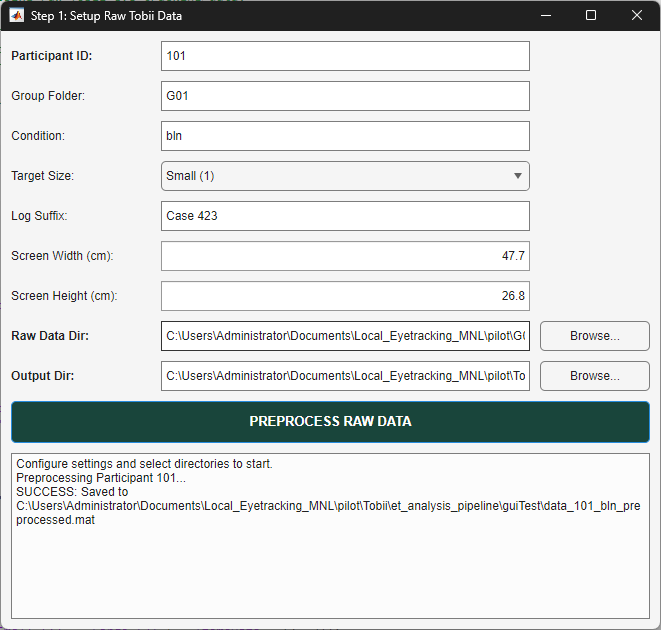

# `gui_1_tobii_prep.m` Documentation

## Overview

`gui_1_tobii_prep` is an interactive MATLAB Graphical User Interface (GUI) wrapper function serving as **Step 1** in the eye-tracking data analysis pipeline. It provides a graphical environment for setting up, configuring, and executing the preprocessing of raw Tobii eye-tracking streams (Lab Streaming Layer / XDF format) and Presentation log files.

The interface allows users to specify participant metadata, experimental task variables, display parameters, and input/output directory paths. Upon user execution, it constructs a standardized configuration structure (`cfg`) and executes the underlying preprocessing engine (`prepare_tobii_data`). It includes status logging, error trapping, and interactive navigation to Step 2 (`single_algo_pipeline_gui`).

---

## Function Signature

```matlab
gui_1_tobii_prep()
```

* **Inputs**: None (interactive UI).
* **Outputs**: None (generates preprocessed `.mat` files on disk via downstream pipeline execution).

---

## User Interface Architecture & Component Layout



The GUI is constructed programmatically using MATLAB App Building components (`uifigure`, `uigridlayout`, `uieditfield`, `uidropdown`, `uibutton`, and `uitextarea`).

### Interface Control Elements

| Grid Row | Component Label | UI Control Type | Default Value | Mapped Configuration Parameter |
| :---: | :--- | :--- | :--- | :--- |
| **1** | Participant ID | `uieditfield` (text) | `'101'` | `cfg.subjectID` |
| **2** | Group Folder | `uieditfield` (text) | `'G01'` | `cfg.group` |
| **3** | Condition | `uieditfield` (text) | `'bln'` | `cfg.condition` |
| **4** | Target Size | `uidropdown` | `'Small (1)'` (Data: `1`) | `cfg.targetSize` (`1` or `2`) |
| **5** | Log Suffix | `uieditfield` (text) | `'Case 423'` | `cfg.logSuffix` |
| **6** | Screen Width (cm) | `uieditfield` (numeric) | `47.7` | `cfg.eyeParams.screenWidthInCm` |
| **7** | Screen Height (cm) | `uieditfield` (numeric) | `26.8` | `cfg.eyeParams.screenHeightInCm` |
| **8** | Raw Data Dir | `uieditfield` + `uibutton` | Current working dir (`pwd`) | `cfg.rawDir` |
| **9** | Output Dir | `uieditfield` + `uibutton` | `pwd/post_step1` | `cfg.outDir` |
| **10** | Run Button | `uibutton` | `'PREPROCESS RAW DATA'` | Action trigger (`processData()`) |
| **11** | Console Log | `uitextarea` | Initializing prompt text | Event logging & error stream |

---

## Configuration Structure (`cfg`) Specifications

When the **"PREPROCESS RAW DATA"** button is pressed, the GUI extracts inputs from all interactive components to construct a `cfg` structure passed directly to `prepare_tobii_data(cfg)`:

```matlab
cfg = struct();
cfg.subjectID                  = efSubjID.Value;          % string (e.g., '101')
cfg.group                      = efGroup.Value;           % string (e.g., 'G01')
cfg.condition                  = efCond.Value;            % string (e.g., 'bln')
cfg.targetSize                 = ddTargetSize.Value;       % integer (1 or 2)
cfg.logSuffix                  = efLogSuffix.Value;        % string (e.g., 'Case 423')
cfg.rawDir                     = efRawDir.Value;           % string file path
cfg.outDir                     = efOutDir.Value;           % string file path
cfg.eyeParams.screenWidthInCm  = efWidth.Value;            % double (e.g., 47.7)
cfg.eyeParams.screenHeightInCm = efHeight.Value;           % double (e.g., 26.8)
cfg.viewGraphs                 = true;                    % boolean flag
```

---

## Operational Execution Workflow

```
+-------------------------------------------------------------------+
|                     gui_1_tobii_prep Execution                    |
+-------------------------------------------------------------------+
                                  |
                                  v
+-------------------------------------------------------------------+
| 1. Launch GUI Window (uifigure & uigridlayout)                    |
|    - Render controls, populate defaults, assign callbacks         |
+-------------------------------------------------------------------+
                                  |
                                  v
+-------------------------------------------------------------------+
| 2. User Input & Directory Selection                               |
|    - Edit parameters or click 'Browse...' (selectDir callback)    |
+-------------------------------------------------------------------+
                                  |
                                  v
+-------------------------------------------------------------------+
| 3. User Clicks 'PREPROCESS RAW DATA'                              |
|    - Disable Run Button to prevent re-entrancy                    |
|    - Construct `cfg` structure                                    |
|    - Log status to Console Log Area                               |
+-------------------------------------------------------------------+
                                  |
                                  v
+-------------------------------------------------------------------+
| 4. Execute Backend Preprocessing Engine                           |
|    - Call: [~, savedFile] = prepare_tobii_data(cfg)               |
+-------------------------------------------------------------------+
            / Success                                  \ Exception
           v                                             v
+-----------------------------------+         +---------------------------+
| Log success to console panel      |         | Log error message to log  |
| Display confirmation dialog       |         | Display uialert modal     |
+-----------------------------------+         | Re-enable Run Button      |
                  |                           +---------------------------+
                  v
+-------------------------------------------------------------------+
| 5. Interactive Prompt: Launch Classification GUI?                 |
|    - Choice 1: 'Launch Classifier' -> single_algo_pipeline_gui()  |
|    - Choice 2: 'Done'              -> Exit callback               |
+-------------------------------------------------------------------+
```

---

## Example Usage

To open the Step 1 GUI from the MATLAB Command Window or a master script:

```matlab
% Launch Step 1 GUI
gui_1_tobii_prep();
```

---

## Downstream Pipeline Integration

* **Step 1 Backend Engine**: `prepare_tobii_data.m`
* **Step 2 GUI Interface**: `single_algo_pipeline_gui.m`
* **Output Pathing**: Saves preprocessed MATLAB variables into `cfg.outDir` (default: `<project_root>\post_step1\`).