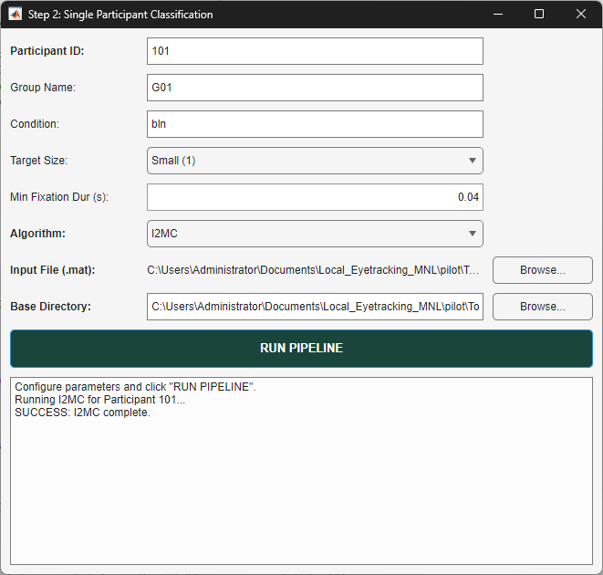

# `gui_2_single_algo_pipeline.m` Documentation

## Overview

`gui_2_single_algo_pipeline` is an interactive MATLAB graphical user interface (GUI) application designed for Step 2 of the eye-hand data processing workflow.

Built using MATLAB's App Designer framework (`uifigure` and `uigridlayout`), the interface enables researchers to configure subject metadata, display and recording parameters, fixation duration thresholds, and event-classification algorithms (`I2MC`, `MNH`, or `REMoDNaV`). The wrapper validates input file integrity and participant ID consistency before delegating computation to the execution engine (`run_single_algorithm_pipeline.m`).

---

## Function Signature

```matlab
gui_2_single_algo_pipeline()
```

* **Arguments**: None.
* **Returns**: None.
* **UI Lifecycle**: Launches a non-modal `uifigure` window. All interactions are handled asynchronously via internal component callbacks.

---

## GUI Layout & Architecture



The application constructs a GUI titled **"Step 2: Single Participant Classification"** using an $11 \times 3$ grid layout:

```
+-------------------------------------------------------------------------+
|                Step 2: Single Participant Classification                |
+-------------------------------------------------------------------------+
| Participant ID:           [ 101                 ]                       |
| Group Name:               [ G01                 ]                       |
| Condition:                [ bln                 ]                       |
| Target Size:              [ Small (1)           ]                       |
| Min Fixation Dur (s):     [ 0.04                ]                       |
| Algorithm:                [ I2MC                ]                       |
| Input File (.mat):        No file selected           [ Browse... ]      |
| Base Directory:           [ /path/to/base       ]    [ Browse... ]      |
+-------------------------------------------------------------------------+
| [                     RUN PIPELINE                      ]               |
+-------------------------------------------------------------------------+
| Console Log Panel (uitextarea)                                          |
| > Configure parameters and click "RUN PIPELINE".                        |
+-------------------------------------------------------------------------+
```

---

## Input Fields & Control Specifications

| UI Element | Component Type | Default Value | Options / Format | Description |
| :--- | :--- | :--- | :--- | :--- |
| **Participant ID** | `uieditfield` (text) | `'101'` | Text / Numeric string | Subject identifier (used for filename validation). |
| **Group Name** | `uieditfield` (text) | `'G01'` | String (e.g., `'G01'`) | Experimental group identifier tag. |
| **Condition** | `uieditfield` (text) | `'bln'` | String (e.g., `'bln'`) | Experimental condition tag. |
| **Target Size** | `uidropdown` | `'Small (1)'` | `Small (1)` ($1$), `Large (2)` ($2$) | Target size flag (affects downstream processing). |
| **Min Fixation Dur (s)** | `uieditfield` (numeric) | `0.04` | Positive float (seconds) | Minimum duration threshold for fixation detection. |
| **Algorithm** | `uidropdown` | `'I2MC'` | `I2MC` (`i2mc`), `MNH` (`mnh`), `REMoDNaV` (`remo`) | Event classification algorithm selection. |
| **Input File (.mat)** | `uilabel` & `uibutton` | `'No file selected'` | `.mat` file path | Path to pre-processed eye-tracking data file. |
| **Base Directory** | `uieditfield` & `uibutton` | `pwd` | Directory path | Root folder path for pipeline outputs. |
| **RUN PIPELINE** | `uibutton` | N/A | Spartan Green (`[0.098 0.271 0.23]`) | Spans all 3 columns; triggers execution pipeline. |
| **Console Log** | `uitextarea` | Status message | Read-only, Word wrap enabled | Spans all 3 columns; displays logs and errors. |

---

## Built-in Configuration Defaults (`cfg`)

When execution is triggered, the GUI populates a configuration structure (`cfg`) passed to `run_single_algorithm_pipeline`. Default display and acquisition hardware specifications are assigned automatically:

```matlab
% User Configured Fields
cfg.subjectID  = efSubjID.Value;
cfg.group      = efGroup.Value;
cfg.condition  = efCond.Value;
cfg.targetSize = ddTargetSize.Value;
cfg.algo       = ddAlgo.Value;          % 'i2mc', 'mnh', or 'remo'
cfg.inputFile  = lblInputFile.Text;
cfg.baseDir    = efBaseDir.Value;

% Hardware & Acquisition Defaults
cfg.eyeParams.minFixDur             = numMinFixDur.Value; % User specified (default 0.04s)
cfg.eyeParams.cmToPixel             = 40;                 % Pixels per cm
cfg.eyeParams.pixelToDegrees        = 0.0226;             % Visual degrees per pixel
cfg.eyeParams.samplingFreq          = 120;                % Hz
cfg.savgolSec                       = 0.042;              % Savitzky-Golay filter window (s)
cfg.savgolFl                        = 5;                  % Savitzky-Golay filter length
cfg.eyeParams.screenResolutionWidth = 1920;               % Horizontal resolution (px)
cfg.eyeParams.screenResolutionHeight= 1080;               % Vertical resolution (px)
cfg.eyeParams.screenWidthInCm       = 47.7;               % Screen width (cm)
cfg.eyeParams.screenHeightInCm      = 26.8;               % Screen height (cm)
```

---

## Callback Mechanics & Pipeline Workflow

```
                        +---------------------------------------+
                        |  gui_2_single_algo_pipeline Launch    |
                        +---------------------------------------+
                                            |
                                            v
                        +---------------------------------------+
                        | User Selects Input MAT & Configures   |
                        +---------------------------------------+
                                            |
                                            v
                        +---------------------------------------+
                        | User Clicks "RUN PIPELINE" Button     |
                        +---------------------------------------+
                                            |
                                            v
                        +---------------------------------------+
                        | 1. Input File & Path Existence Check  |
                        +---------------------------------------+
                                            |
                                            v
                        +---------------------------------------+
                        | 2. Participant ID Mismatch Check      |
                        |    - Check if filename has Subject ID |
                        |    - Warn user via uiconfirm if not   |
                        +---------------------------------------+
                                            |
                                            v
                        +---------------------------------------+
                        | 3. Assemble Configuration Structure   |
                        |    - Combine user inputs & defaults   |
                        +---------------------------------------+
                                            |
                                            v
                        +----------------------------------------+
                        | 4. Pipeline Execution                  |
                        |    - Disable RUN button                |
                        |    - Call run_single_algorithm_pipeline|
                        |    - Catch ME errors & display alert   |
                        |    - Re-enable RUN button              |
                        +----------------------------------------+
```

---

## Operating Instructions

### Standard Usage
1. Type `gui_2_single_algo_pipeline` in the MATLAB Command Window or load file & click Run in MATLAB Editor.
2. Enter the **Participant ID** (e.g., `101`), **Group Name** (e.g., `G01`), and **Condition** (e.g., `bln`).
3. Select the **Target Size** ($1$ for Small, $2$ for Large) and set the **Min Fixation Duration** (e.g., `0.04` seconds).
4. Select the desired **Algorithm** (`I2MC`, `MNH`, or `REMoDNaV`).
5. Click **Browse...** next to **Input File (.mat)** to choose the participant's data file.
6. Verify or change the **Base Directory** output path.
7. Click **RUN PIPELINE**.

---

## Dependencies & External Calls

* **MATLAB App Designer UI Engine**: Requires MATLAB R2020a or newer supporting `uifigure`, `uigridlayout`, `uieditfield`, `uidropdown`, `uibutton`, `uitextarea`, `uialert`, and `uiconfirm`.