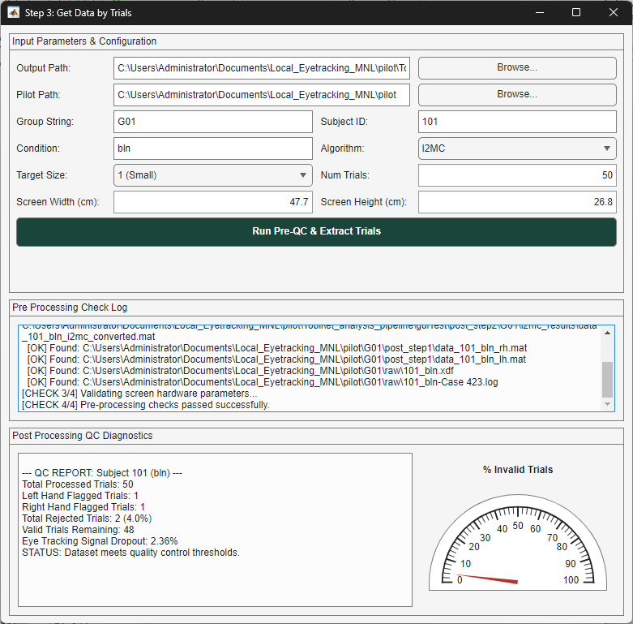

# `gui_3_data_by_trials.m` Documentation

## Overview

`gui_3_data_by_trials` is a MATLAB graphical user interface (GUI) application built with App Designer / `uifigure` components. It serves as an interactive wrapper for step 3 of the eye-hand data processing pipeline (`get_data_by_trials.m`). 

The application streamlines trial segmentation and quality control (QC) diagnostics by:
1. Providing an intuitive configuration interface for file paths, subject details, acquisition parameters, and eye-tracking algorithms.
2. Performing automated pre-execution safety checks to verify that all required raw and post-step 1 & 2 files exist before launching processing.
3. Invoking the core trial-segmentation engine (`get_data_by_trials.m`).
4. Computing post-execution quality control metrics (e.g., kinematic trial rejection rates, eye-tracking signal dropout, short-segment warnings) and displaying them via text logs and a visual semicircular gauge.

---

## GUI Architecture & Component Layout



The interface is constructed within a `uifigure` titled **"Step 3: Get Data by Trials"**, organized using a 3-row `uigridlayout`:

```
+-------------------------------------------------------------------------+
|                        Step 3: Get Data by Trials                       |
+-------------------------------------------------------------------------+
|  PANEL 1: Input Parameters & Configuration                              |
|  - Output Path & Pilot Path fields with "Browse..." buttons             |
|  - Group, Subject ID, Condition, Algorithm, Target Size, Num Trials     |
|  - Display Dimensions (Screen Width & Height in cm)                     |
|  - [ Run Pre-QC & Extract Trials ] Button                               |
+-------------------------------------------------------------------------+
|  PANEL 2: Pre Processing Check Log                                      |
|  - Non-editable text area detailing step-by-step pre-checks             |
+-------------------------------------------------------------------------+
|  PANEL 3: Post Processing QC Diagnostics                                |
|  - Diagnostic summary log text area (left)                              |
|  - Semicircular Gauge (% Invalid Trials, 0-100%) (right)                |
+-------------------------------------------------------------------------+
```

### Layout Grid Specifications

| Panel | Grid Rows $	\times$ Cols | Dimensions / Spacing | Purpose |
| :--- | :--- | :--- | :--- |
| **Main Window Grid** | $3 \times 1$ | Rows: `{320, 150, '1x'}`, Spacing: `8px`, Padding: `10px` | Top-level container grid. |
| **Panel 1 (Inputs)** | $7 \times 4$ | Rows: `{28, 28, 28, 28, 28, 28, 36}px`, Cols: `{110, '1x', 110, '1x'}` | Parameter input controls and execution trigger. |
| **Panel 2 (Pre-Checks)** | $1 \times 1$ | Flexible fit (`1x` $\times$ `1x`) | Real-time pre-processing file existence and validation log. |
| **Panel 3 (Post-QC)** | $1 \times 2$ | Cols: `{'1x', 240}`, Gauge Box: $2\times 1$ | Diagnostic output summary and invalid trial percentage gauge. |

---

## User Interface Controls & Input Specifications

### Panel 1: Parameter Inputs & Configuration

| UI Element | Control Type | Default Value | Valid Range / Options | Description |
| :--- | :--- | :--- | :--- | :--- |
| **Output Path** | `uieditfield` (text) | `pwd` | Valid directory path | Root directory path where `post_step2` inputs and `post_step3` outputs reside. |
| **Output Path Browse** | `uibutton` | `"Browse..."` | N/A | Opens directory selector (`uigetdir`) to set `Output Path`. |
| **Pilot Path** | `uieditfield` (text) | `pwd` | Valid directory path | Path containing raw files (`raw/`) and kinematic files (`post_step1/`). |
| **Pilot Path Browse** | `uibutton` | `"Browse..."` | N/A | Opens directory selector (`uigetdir`) to set `Pilot Path`. |
| **Group String** | `uieditfield` (text) | `'G01'` | Text string (e.g., `'G01'`, `'G02'`) | Participant group identifier string. |
| **Subject ID** | `uieditfield` (text) | `'101'` | Numeric / Text identifier | Participant subject ID string or integer. |
| **Condition** | `uieditfield` (text) | `'bln'` | Text tag (e.g., `'bln'`, `'pert'`) | Experimental condition string tag. |
| **Algorithm** | `uidropdown` | `'I2MC'` (`'i2mc'`) | `I2MC` (`i2mc`), `MNH` (`mnh`), `REMoDNaV` (`remo`) | Eye classification algorithm tag. |
| **Target Size** | `uidropdown` | `'1 (Small)'` (`1`) | `1 (Small)` ($1$), `2 (Large)` ($2$) | Task target size tag ($2$ appends `_lg` to filenames). |
| **Num Trials** | `uieditfield` (numeric) | `50` | $1 \dots 1000$ | Expected total trial count to segment. |
| **Screen Width (cm)** | `uieditfield` (numeric) | `47.7` | $1 \dots 300$ cm | Physical screen width in cm. |
| **Screen Height (cm)** | `uieditfield` (numeric) | `26.8` | $1 \dots 300$ cm | Physical screen height in cm. |
| **Run Button** | `uibutton` | `"Run Pre-QC..."` | Background: `[0.098, 0.271, 0.23]` (Spartan Green) | Triggers execution callback (`executePipeline`). |

---
## Workflow & Function Callback Architecture

```
                       +-----------------------------------+
                       |    gui_3_data_by_trials() Launch  |
                       +-----------------------------------+
                                         |
                                         v
                       +------------------------------------+
                       | User Configures Parameters & Clicks|
                       | "Run Pre-QC & Extract Trials"      |
                       +------------------------------------+
                                         |
                                         v
                       +-----------------------------------+
                       | executePipeline(...) Callback     |
                       +-----------------------------------+
                                         |
        +--------------------------------+--------------------------------+
        |                                                                 |
        v                                                                 v
+-----------------------------------+                           +-----------------------------------+
| 1. Pre Safety Checks              |                           | 2. Pipeline Execution             |
|  - Verify directory existence     |                           |  - Construct EyeParams struct     |
|  - Resolve converted MAT file     |                           |  - Launch progress dialog         |
|  - Verify 5 required files        |                           |  - Call get_data_by_trials()      |
|  - Validate screen dimensions     |                           +-----------------------------------+
+-----------------------------------+                                             |
        |                                                                         v
        +--------------------------------+----------------------------------------+
                                         |
                                         v
                       +------------------------------------+
                       | 3. Post-Processing QC Diagnostics  |
                       |  - Load generated MAT file         |
                       |  - Calculate rejected trial %      |
                       |  - Update semicircular gauge       |
                       |  - Compute NaN gaze sample dropout |
                       |  - Check for short eye trials (<50)|
                       |  - Issue warnings / status report  |
                       +------------------------------------+
```

---

## Detailed Processing Phases

#### Phase A: Pre-Processing Safety Checks
Before running trial extraction, the pipeline verifies:
1. **Directory Existence**: Confirms both `baseFilePath` and `pilotPath` exist on disk using `exist(..., 'dir')`.
2. **Converted Eye File Resolution**: Checks for algorithm output file using smart resolution:
   - Primary target: `<baseFilePath>/post_step2/<group>/<algo>_results/data_<subj>_<cond>[_lg]_<algo>_converted_v3.mat`
   - Fallback target: `..._converted.mat`
3. **File Dependency Verification**: Confirms existence of all 5 required input files:
   - Resolved algorithm MAT file (`eyeFile`)
   - Right-hand kinematics MAT file (`data_<subj>_<cond>_rh[_lg].mat`)
   - Left-hand kinematics MAT file (`data_<subj>_<cond>_lh[_lg].mat`)
   - Lab Streaming Layer recording (`<subj>_<cond>[_lg].xdf`)
   - Presentation log file (`<subj>_<cond>[_lg]-Case 423.log`)
4. **Hardware Parameter Validation**: Ensures `screenWidth` and `screenHeight` are strictly positive ($> 0$).

If any check fails, execution halts immediately, a modal alert (`uialert`) is displayed, and errors are logged to Panel 2.

#### Phase B: Pipeline Execution
Constructs the parameter structure:
```matlab
EyeParams.screenWidthInCm  = screenW;
EyeParams.screenHeightInCm = screenH;
EyeParams.samplingFreq     = 120;
```
Launches a modal progress dialog (`uiprogressdlg`) and executes:
```matlab
[eyeTrialData, raw_eyeTrialData, handTrialData] = get_data_by_trials( ...
    baseFilePath, pilotPath, EyeParams, ui_group_str, ...
    ui_subjectID, ui_condition_str, ui_algo_str, ui_targetSize_int, numTrials);
```

#### Phase C: Quality Control (QC) Diagnostics
After data extraction completes, the callback reads the saved output file (`post_step3/.../data_*.mat`) and performs quality assessment:

1. **Trial Rejection Analysis**:
   - Counts left-hand flagged trials (`left_wrong_trials == 1`).
   - Counts right-hand flagged trials (`right_wrong_trials == 1`).
   - Calculates total rejected trials ($N_{\text{rejected}} = \sum (\text{left\_wrong} \mid \text{right\_wrong})$).
   - Computes percentage invalid ($Pct_{\text{invalid}} = \frac{N_{\text{rejected}}}{\text{numTrials}} \times 100\%$).
   - Updates the semicircular gauge `gaugeInvalid.Value`.

2. **Signal Dropout & Segment Shortness Analysis**:
   - Loops through valid (non-rejected) trials.
   - Evaluates eye classified sample counts ($N_{\text{samples}}$). Flags valid trials where $N_{\text{samples}} < 50$.
   - Calculates NaN sample rates in raw gaze $X$-coordinates across valid trials:
     $$Pct_{\text{EyeLoss}} = \frac{N_{\text{NaN}}}{N_{\text{total\_samples}}} \times 100\%$$

3. **QC Diagnostic Thresholds & Alert Warnings**:

| Quality Indicator | Metric / Threshold | Action Taken |
| :--- | :--- | :--- |
| **Short Eye Segment** | Any valid trial with $< 50$ eye samples | Logged in Panel 3 + Pop-up warning dialog (`uialert`). |
| **Kinematic Error Rate** | Rejected trials $> 25.0\%$ | Panel 3 Warning log: `"WARNING: Rejecting > 25% of trials due to kinematic errors."` |
| **Eye Signal Loss** | NaN eye dropout $> 20.0\%$ | Panel 3 Warning log: `"WARNING: High eye tracking sample loss (> 20% NaN). Check participant dataset."` |
| **Data Quality Pass** | Rejection $\le 25\%$, Loss $\le 20\%$, No short segments | Panel 3 Status log: `"STATUS: Dataset meets quality control thresholds."` |

---

## File System Structure & Output Paths

The GUI expects and creates the following project folder structure:

```
<baseFilePath>/
├── post_step2/
│   └── <ui_group_str>/
│       └── <ui_algo_str>_results/
│           └── data_<subj>_<cond>[_lg]_<algo>_converted.mat      (Eye data file)
└── post_step3/
    └── <ui_group_str>/
        └── <ui_algo_str>/
            └── data_<subj>_<cond>[_lg]_<algo>.mat                (Output File)

<pilotPath>/
└── <ui_group_str>/
    ├── post_step1/
    │   ├── data_<subj>_<cond>_rh[_lg].mat                        (Right Hand post step1)
    │   └── data_<subj>_<cond>_lh[_lg].mat                        (Left Hand post step1)
    └── raw/
        ├── <subj>_<cond>[_lg].xdf                                (LSL Stream Xdf)
        └── <subj>_<cond>[_lg]-Case 423.log                       (Presentation Log)
```

---

## Complete Usage Example

Below is a step-by-step example demonstrating how to launch and operate the GUI wrapper in MATLAB.

### Launching the Interface
```matlab
% Run the GUI application from the MATLAB Command Window or script
gui_3_data_by_trials();
```

### Scripted Configuration equivalent
```matlab
% Set up configuration parameters as used by the GUI execution logic
baseFilePath      = 'Z:\Data\Eyetracking\pilot\yourOutputFolder';
pilotPath         = 'Z:\Data\Eyetracking\pilot';
ui_group_str      = 'G01';
ui_subjectID      = '101';
ui_condition_str  = 'bln';
ui_algo_str       = 'i2mc';
ui_targetSize_int = 1;      % 1 = Small, 2 = Large (_lg suffix)
numTrials         = 50;
screenWidth       = 47.7;   % Screen width in cm
screenHeight      = 26.8;   % Screen height in cm

% The GUI will perform pre-checks, execute get_data_by_trials,
% and populate the QC report automatically upon clicking "Run Pre-QC".
```

---

## Key Dependencies & System Requirements

To run `gui_3_data_by_trials.m`, the following components must be available:

1. **MATLAB App Designer UI Engine**: Requires MATLAB R2020a or newer with support for `uifigure`, `uigridlayout`, `uipanel`, `uieditfield`, `uibutton`, `uitextarea`, `uigauge`, and `uiprogressdlg`.
2. **Core Pipeline Function**: `get_data_by_trials.m` must be on the MATLAB path.
3. **Helper Functions**:
   - `load_TobiiPresentation` (David McFarlane custom function)
   - `Presentation_to_LSL_offset` (David McFarlane custom function)