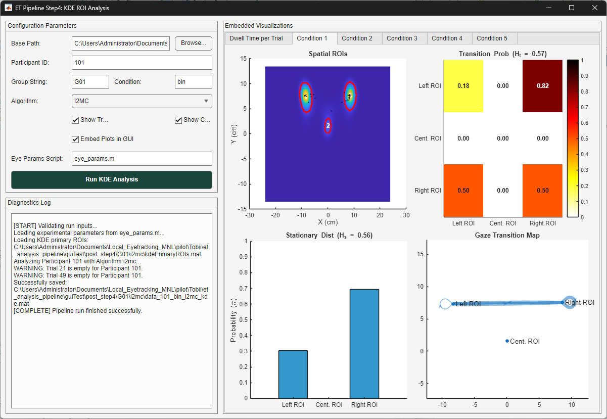

# `gui_4_kde_roi_analysis.m` Documentation

## Overview

`gui_4_kde_roi_analysis` is an interactive MATLAB Graphical User Interface (GUI) wrapper and execution engine serving as **Step 4** (Kernel Density Estimation variant) in the eye-tracking analysis pipeline. Unlike predefined geometric ROI analysis, this function uses spatial Kernel Density Estimation (KDE) primary ROI maps (`kdePrimaryROIs.mat`) generated from continuous gaze density distributions to define data-driven ROI boundaries.

The pipeline maps participant fixation and gaze event coordinates directly to grid-indexed KDE label matrices, computing trial- and condition-level dwell times, mean distance to centroids (MDC), fixation counts, transition probability matrices, stationary distributions, and relative gaze transition entropy metrics.

---

## Architecture & Subfunction Summary

The file contains five primary internal functions:

1. **`gui_4_kde_roi_analysis()`**: Primary UI constructor. Sets up the two-column interface, configuration controls, diagnostic logging window, and embedded visualization tab group with `uiaxes` components.
2. **`runCallback(...)`**: Event handler for the "Run KDE Analysis" button. Validates input paths, parses participant ID ranges, checks for mandatory `kdePrimaryROIs.mat` files, executes parameter setup scripts, and triggers pipeline processing with progress monitoring.
3. **`process_kde_roi_analysis(...)`**: Core mathematical and spatial processing engine. Performs spatial grid lookup, maps fixations and pursuits to KDE ROI labels, aggregates trial and condition metrics, computes Markov transition probabilities and entropy measures, and renders visualizations.
4. **`logMsg(txt, msg)`**: Diagnostic logging helper appending timestamped messages to the UI text area or printing to the console.
5. **`ifelse(cond, trueVal, falseVal)`**: Functional ternary evaluation helper.

---

## Function Signatures

```matlab
% Main UI Launcher
gui_4_kde_roi_analysis()

% Execution Callback
runCallback(baseFilePath, subjectStr, groupStr, condStr, algoStr, ...
    showTrialFigs, showCondFigs, embedInGUI, paramsScript, txtLog, fig, guiAxes)

% Core Analytical Engine
process_kde_roi_analysis(baseFilePath, subject_list, EyeParams, ...
    ui_group_str, ui_condition_str, ui_algo_str, showTrialFigs, showFigs, ...
    embedInGUI, guiAxes, logFcn)
```

---

## User Interface Layout & Control Elements



The GUI uses a split `uigridlayout` divided into two primary panels:
* **Left Panel**: Configuration parameters, file path pickers, and diagnostic logging textarea.
* **Right Panel**: Embedded tab group hosting multi-panel `uiaxes` plots for trial-level and condition-level visualizations.

### Input Controls Table

| Row | Component | Type | Default Value | Mapped Variable | Description |
| :---: | :--- | :--- | :--- | :--- | :--- |
| **1** | Base Path | `uieditfield` + `uibutton` | `pwd` | `baseFilePath` | Root project directory. |
| **2** | Participant ID | `uieditfield` (text) | `'101'` | `subjectStr` | Participant ID string or array expression (e.g., `'101:105'`). |
| **3** | Group String | `uieditfield` (text) | `'G01'` | `groupStr` | Experimental group tag. |
| **3** | Condition | `uieditfield` (text) | `'bln'` | `condStr` | Experimental condition identifier. |
| **4** | Algorithm | `uidropdown` | `'I2MC'` (`'i2mc'`) | `algoStr` | Event classification algorithm (`'i2mc'`, `'mnh'`, `'remo'`). |
| **5** | Show Trial Figs | `uicheckbox` | `true` | `showTrialFigs` | Toggle to render trial-level dwell scatter plots. |
| **5** | Show Condition Figs | `uicheckbox` | `true` | `showCondFigs` | Toggle to render condition-level quad-panel figures. |
| **6** | Embed Plots in GUI | `uicheckbox` | `true` | `embedInGUI` | Renders figures inside GUI tabs vs standalone figure windows. |
| **7** | Eye Params Script | `uieditfield` (text) | `'eye_params.m'` | `paramsScript` | MATLAB setup script defining `EyeParams` conversion metrics. |
| **8** | Run Button | `uibutton` | `'Run KDE Analysis'` | Action Trigger | Executes input validation and launches processing pipeline. |

---

## Methodology

### 1. Spatial Grid Lookup & ROI Mapping
Coordinates $(X, Y)$ in centimeters are converted to spatial grid indices $(Row, Col)$ using grid limits ($x_{\min} = -23.85, x_{\max} = 23.85, y_{\min} = -13.4, y_{\max} = 13.4$) and step sizes ($dx, dy$):

$$Col = \left\lfloor \frac{X - x_{\min}}{dx} \right \rfloor + 1, \quad Row = \left\lfloor \frac{Y - y_{\min}}{dy} \right \rfloor + 1$$

The event ROI label $L$ is retrieved from the pre-computed matrix: $L = \text{primaryKde.labeled}(Row, Col)$. If indices fall outside the grid, $L = -1$.

### 2. Distance to Centroid (MDC)
For fixations falling in ROI $k$, Euclidean distance to the KDE region centroid $(CX_k, CY_k)$ in centimeters is computed and converted to degrees of visual angle ($\text{deg}$):

$$d = \sqrt{(X - CX_k)^2 + (Y - CY_k)^2}$$

$$\text{MDC}_k = \bar{d}_k \times \text{EyeParams.cm2Deg}$$

### 3. Stationary Entropy ($H_s$)
Based on total dwell time proportion across $N$ KDE ROIs ($p_i = \frac{\text{tDwell}_i}{\sum \text{tDwell}}$):

$$H_s = -\sum_{i=1}^{N} p_i \log_2(p_i), \quad H_{s,\text{rel}} = \frac{H_s}{\log_2(N)}$$

### 4. Transition Entropy ($H_t$)
Derived from the state transition matrix counts $T_{ij}$, row transition probabilities $p_{ij} = \frac{T_{ij}}{\sum_j T_{ij}}$ give:

$$H_t = \sum_{i=1}^{N} p_i \left( -\sum_{j=1}^{N} p_{ij} \log_2(p_{ij}) \right), \quad H_{t,\text{rel}} = \frac{H_t}{\log_2(N)}$$

---

## Diagnostics, Warnings & Sparse Matrix Flags

The pipeline incorporates automated data integrity checks to alert the researcher to sparse transition counts or missing spatial files.

### 1. Sparse Transition Matrix Flag (`sparseSafetyCheck`)
* **Trigger Condition**: Total observed transitions across all KDE ROIs in a condition block is less than double the total number of ROIs ($\sum T_{ij} < 2 \times N_{\text{ROIs}}$).
* **Flag Assigned**: `kdeData.ConditionLevel.(condName).sparseSafetyCheck = 1` (normal matrix density sets this to `0`).
* **Console / Log Alert**:
  ```text
  WARNING: Sparse transition matrix in Cond <c> (Sum = <matrixSum>)
  ```
* **Impact**: Flags condition blocks where Gaze Transition Entropy ($H_t$) calculations may suffer from small-sample bias.

### 2. Insufficient Fixations Check
* **Trigger Condition**: Fewer than 2 fixations are assigned to KDE ROIs within a condition block ($\text{length}(roiSequence) \le 1$).
* **Flag Assigned**: `kdeData.ConditionLevel.(condName).sparseSafetyCheck = NaN`.
* **Console / Log Alert**:
  ```text
  Condition <c>: Not enough transitions to compute GTE reliably
  ```
* **Impact**: Transition matrix ($p_{ij}$), stationary distribution ($p_i$), $H_s$, $H_{s,\text{rel}}$, $H_t$, and $H_{t,\text{rel}}$ are set to `NaN` or empty arrays `[]`.

### 3. File & Parameter Validation Warnings
* **Missing KDE Primary File**: If `kdePrimaryROIs.mat` is missing under `post_step4\<group>\<algo>/`, the GUI displays an error popup: `KDE ROI file not found at: <path>`.
* **Missing Participant File**: If neither versioned (`data_<ID>_<cond>_<algo>_v9.mat`) nor unversioned (`data_<ID>_<cond>_<algo>.mat`) input files are found, logs `WARNING: Input file not found for Participant <ID>. Skipping...`.
* **Missing `predefinedData` Struct**: If input `.mat` files lack the required base event matrix structure, logs `ERROR: "predefinedData" structure missing in <file>`.

---

## Output Data Structure (`kdeData`)

Saved MAT files: `<baseFilePath>/post_step4/<groupStr>/<algoStr>/data_<ID>_<condStr>_<algoStr>_kde.mat`.

```matlab
kdeData
├── TrialLevel
│   ├── conditionLabel     (50x1 double)  - Condition identifier (1..5)
│   ├── fixCountA/B/C      (50x1 double)  - Fixation counts per KDE ROI (1=Left, 3=Right, 2=Center)
│   ├── tDwellA/B/C        (50x1 double)  - Dwell times (seconds) per ROI
│   ├── mdcA/B/C           (50x1 double)  - Mean distance to centroid (deg)
│   ├── norm_tDwellA/B/C   (50x1 double)  - Normalized dwell times
│   ├── pursCountA/B/C     (50x1 double)  - Pursuit event counts per ROI
│   ├── pursDurA/B/C       (50x1 double)  - Pursuit durations (seconds) per ROI
│   └── roiTotalEngagement (50x1 double)  - Total combined fixation & pursuit engagement time
└── ConditionLevel
    └── c1 .. c5
        ├── roiDwell           (Nx1 double)   - Dwell time per KDE ROI
        ├── tDwell             (double)       - Total condition dwell time
        ├── insideROICount     (Nx1 double)   - Fixation count per KDE ROI
        ├── mdc                (Nx1 double)   - Mean distance to centroids (deg)
        ├── roiPursDwell       (Nx1 double)   - Pursuit dwell time per ROI
        ├── tPursDwell         (double)       - Total pursuit dwell time
        ├── pursCount          (Nx1 double)   - Pursuit event count per ROI
        ├── roiTotalEngagement (double)       - Sum of fixations + pursuit dwell times
        ├── matrixSum          (double)       - Total transition count sum
        ├── sparseSafetyCheck  (double)       - 0 (normal), 1 (sparse), or NaN (insufficient)
        ├── p_ij               (NxN double)   - Transition probability matrix
        ├── p_i                (Nx1 double)   - Stationary distribution vector
        ├── Hs / Hs_rel        (double)       - Stationary entropy (bits / relative)
        └── Ht / Ht_rel        (double)       - Transition entropy (bits / relative)
```

---

## Visualizations Rendered

When enabled, the graphical interface renders:

1. **Trial-Level Dwell Time**: Multi-series scatter plot across 50 trials tracking dwell times in Left (Red), Right (Green), and Center (Blue) KDE ROIs with vertical condition demarcations ($X = 11, 21, 31, 41$).
2. **Condition-Level Quad Panels** (Tabs `Condition 1` through `Condition 5`):
   * **Spatial ROIs**: Continuous spatial KDE heatmap with interpolated dynamic boundary outlines (`bwboundaries`), centroid labels ($1..N$), and scatter overlay of participant fixations.
   * **Transition Matrix Heatmap**: Annotated $N 	imes N$ probability heatmap with relative transition entropy ($H_{t,\text{rel}}$) in title.
   * **Stationary Distribution**: Column bar graph of ROI stationary probabilities ($\pi_i$) with relative stationary entropy ($H_{s,\text{rel}}$).
   * **Gaze Transition Map / Digraph**: Directional node graph displaying gaze transitions between ROI centroids with edge line widths scaled to transition volume.