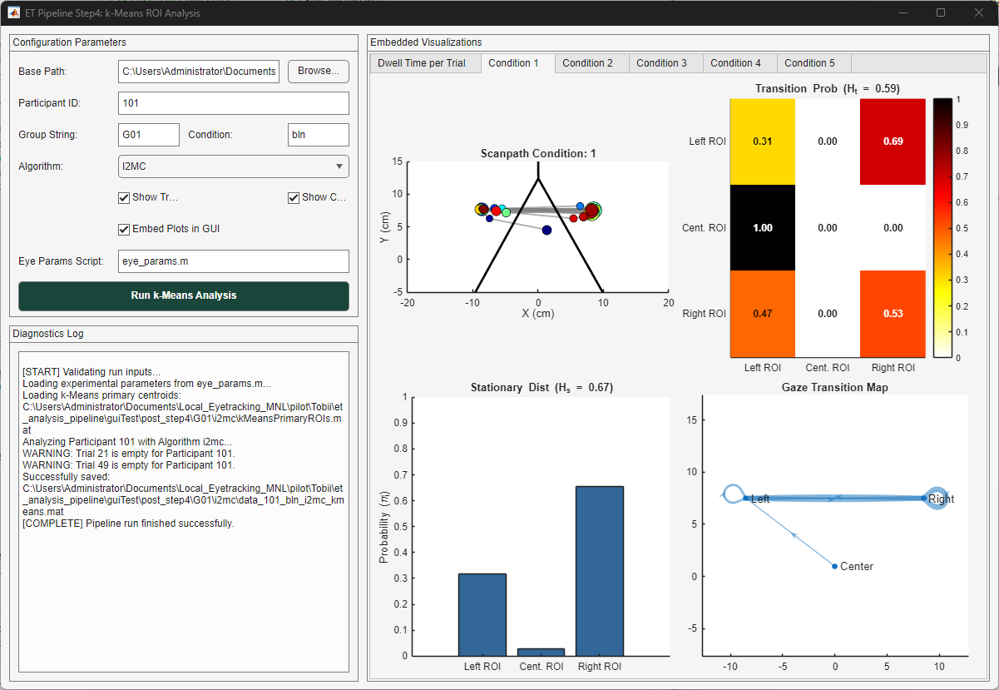

# `gui_4_kmeans_roi_analysis.m` Technical Documentation

## Overview

`gui_4_kmeans_roi_analysis` is an interactive MATLAB Graphical User Interface (GUI) wrapper and analytical pipeline serving as **Step 4** ($k$-means variant) in the eye-tracking data processing framework. Unlike fixed geometric ROIs or spatial Kernel Density Estimation (KDE) density maps, this function uses data-driven $k$-means cluster centroids (`kMeansPrimaryROIs.mat`) to define spatial regions of interest (ROIs).

Fixation and smooth pursuit event coordinates are assigned to the nearest primary cluster centroid using $k$-nearest neighbors (`knnsearch`). The pipeline extracts both trial- and condition-level metrics, including dwell times, mean distance to centroids (MDC), fixation counts, pursuit engagement, transition probability matrices, stationary distributions, and relative gaze transition entropy.

---

## Architecture & Subfunction Summary

The file comprises five internal subfunctions:

1. **`gui_4_kmeans_roi_analysis()`**: Main UI builder. Sets up a two-column figure layout with input controls, diagnostic logging text area, and embedded multi-panel tabbed plot axes.
2. **`runCallback(...)`**: Event handler for the "Run k-Means Analysis" button. Validates user input fields, parses numeric participant list ranges, checks for required MAT data files, executes setup parameter scripts, and triggers processing with an interactive progress dialog.
3. **`process_kmeans_roi_analysis(...)`**: Core mathematical and spatial execution function. Performs nearest-centroid event assignment, accumulates trial and condition metrics, computes Markov transition matrices and entropy values, generates graphics, and outputs structured MAT files.
4. **`logMsg(txt, msg)`**: Helper function to append log messages to the GUI text area control or print directly to the console.
5. **`ifelse(cond, trueVal, falseVal)`**: Functional ternary evaluation utility.

---

## Function Signatures

```matlab
% Primary Interface Launcher
gui_4_kmeans_roi_analysis()

% Execution Control Handler
runCallback(baseFilePath, subjectStr, groupStr, condStr, algoStr, ...
    showTrialFigs, showCondFigs, embedInGUI, paramsScript, txtLog, fig, guiAxes)

% Core Processing & Calculation Engine
process_kmeans_roi_analysis(baseFilePath, subject_list, EyeParams, ...
    ui_group_str, ui_condition_str, ui_algo_str, showTrialFigs, showFigs, ...
    embedInGUI, guiAxes, logFcn)
```

---

## User Interface Layout & Control Elements


The interface splits into two primary vertical columns:
* **Left Panel**: Holds configuration parameters, path selection controls, and execution logging.
* **Right Panel**: Embeds tabbed visualization panels for trial-level and condition-level dashboards.

### Input Controls Specification

| Row | Component | Type | Default Value | Mapped Parameter | Description |
| :---: | :--- | :--- | :--- | :--- | :--- |
| **1** | Base Path | `uieditfield` + `uibutton` | `pwd` | `baseFilePath` | Root directory containing project step folders. |
| **2** | Participant ID | `uieditfield` (text) | `'101'` | `subjectStr` | Participant ID or range expression (e.g., `'101:110'`). |
| **3** | Group String | `uieditfield` (text) | `'G01'` | `groupStr` | Experimental group tag. |
| **3** | Condition | `uieditfield` (text) | `'bln'` | `condStr` | Experimental condition identifier. |
| **4** | Algorithm | `uidropdown` | `'I2MC'` (`'i2mc'`) | `algoStr` | Classification algorithm selection (`'i2mc'`, `'mnh'`, `'remo'`). |
| **5** | Show Trial Figs | `uicheckbox` | `true` | `showTrialFigs` | Toggles rendering of 50-trial dwell scatter plots. |
| **5** | Show Condition Figs | `uicheckbox` | `true` | `showCondFigs` | Toggles rendering of condition quad-panel dashboards. |
| **6** | Embed Plots in GUI | `uicheckbox` | `true` | `embedInGUI` | Directs plot rendering into GUI tabs vs standalone figure windows. |
| **7** | Eye Params Script | `uieditfield` (text) | `'eye_params.m'` | `paramsScript` | MATLAB script defining target coordinates and `EyeParams.cm2Deg`. |
| **8** | Run Button | `uibutton` | `'Run k-Means Analysis'` | Action Trigger | Initiates input validation and triggers processing pipeline. |

---

## Methodology

### 1. Nearest Neighbor ROI Assignment
Given an event centroid $(X_e, Y_e)$ (fixation or pursuit), spatial classification assigns the event to cluster $k$ via Euclidean $k$-nearest neighbor search against $N$ primary $k$-means centroids $\mathbf{C} = \{C_1, C_2, \dots, C_N\}$:

$$k^* = \arg\min_{k} \sqrt{(X_e - C_{k,x})^2 + (Y_e - C_{k,y})^2}$$

* **Cluster Index Mapping**:
  * Index `1`: Left ROI (Cluster A)
  * Index `2`: Center ROI (Cluster C)
  * Index `3`: Right ROI (Cluster B)

### 2. Mean Distance to Centroid (MDC)
For fixations assigned to cluster $k$, Euclidean distance $d_m$ to centroid $C_k$ is averaged and converted from centimeters to visual angle degrees ($	\text{deg}$):

$$\text{MDC}_k = \left( \frac{1}{M} \sum_{m=1}^{M} d_m \right) \times \text{EyeParams.cm2Deg}$$

### 3. Stationary Distribution Entropy ($H_s$)
Calculated from proportional total dwell times across $N=3$ ROIs ($p_i = \frac{\text{tDwell}_i}{\sum \text{tDwell}}$):

$$H_s = -\sum_{i=1}^{N} p_i \log_2(p_i), \quad H_{s,\text{rel}} = \frac{H_s}{\log_2(N)}$$

### 4. Gaze Transition Entropy ($H_t$)
Given transition matrix counts $T_{ij}$ and row transition probabilities $p_{ij} = \frac{T_{ij}}{\sum_j T_{ij}}$:

$$H_t = \sum_{i=1}^{N} p_i \left( -\sum_{j=1}^{N} p_{ij} \log_2(p_{ij}) \right), \quad H_{t,\text{rel}} = \frac{H_t}{\log_2(N)}$$

---

## Diagnostics, Warnings & Sparse Matrix Checks

### 1. Sparse Transition Matrix Flag (`sparseSafetyCheck`)
* **Trigger Condition**: Total transition count across all $k$-means centroids within a condition is less than the square of the number of ROIs ($\sum T_{ij} < N_{\text{ROIs}}^2 = 9$).
* **Assigned Value**: `kmeansData.ConditionLevel.(condName).sparseSafetyCheck = 1` (normal density sets this to `0`).
* **Console / Log Warning**:
  ```text
  WARNING: Sparse transition matrix in Cond <c> (Sum = <matrixSum>)
  ```
* **Purpose**: Identifies condition blocks where small-sample bias may skew Gaze Transition Entropy ($H_t$) calculations.

### 2. Missing Fixations / Insufficient Transitions
* **Trigger Condition**: No fixations detected or total sequence length is less than 2 ($\text{length}(roiSequence) \le 1$).
* **Assigned Value**: `kmeansData.ConditionLevel.(condName).sparseSafetyCheck = NaN`.
* **Console / Log Warning**:
  ```text
  Condition <c>: Not enough transitions
  ```
* **Impact**: Transition matrix ($p_{ij}$), stationary distribution ($p_i$), $H_s$, $H_{s,\text{rel}}$, $H_t$, and $H_{t,\text{rel}}$ are assigned `NaN` or set to empty matrices `[]`.

### 3. File & Path Exceptions
* **Missing $k$-Means Centroid File**: If `kMeansPrimaryROIs.mat` is missing under `post_step4\<group>\<algo>\`, raises popup error: `k-Means ROI file not found at: <path>`.
* **Missing Subject File**: If versioned (`data_<ID>_<cond>_<algo>_v9.mat`) and unversioned (`data_<ID>_<cond>_<algo>.mat`) files are absent, logs `WARNING: Input file not found for Participant <ID>. Skipping...`.

---
## Output Data Structure (`kmeansData`)

Output MAT file location: `<baseFilePath>\post_step4\<groupStr>\<algoStr>\data_<ID>_<condStr>_<algoStr>_kmeans.mat`.

```matlab
kmeansData
├── TrialLevel
│   ├── conditionLabel     (50x1 double)  - Condition block index (1..5)
│   ├── fixCountA/B/C      (50x1 double)  - Fixation counts per k-Means ROI (A=Left, B=Right, C=Center)
│   ├── tDwellA/B/C        (50x1 double)  - Total fixation dwell time (s) per ROI
│   ├── meanFixDurA/B/C    (50x1 double)  - Mean fixation duration (s) per ROI
│   ├── mdcA/B/C           (50x1 double)  - Mean distance to centroid (deg) per ROI
│   ├── norm_tDwellA/B/C   (50x1 double)  - Normalized dwell time ratios
│   ├── pursCountA/B/C     (50x1 double)  - Smooth pursuit event counts per ROI
│   ├── pursDurA/B/C       (50x1 double)  - Smooth pursuit durations (s) per ROI
│   └── roiTotalEngagement (50x1 double)  - Total dwell time (fixations + pursuits)
└── ConditionLevel
    └── c1 .. c5
        ├── fixCountA/B/C      (double)   - Fixation count per ROI in condition
        ├── tDwellA/B/C        (double)   - Total dwell time per ROI in condition
        ├── meanFixDurA/B/C    (double)   - Mean fixation duration per ROI
        ├── mdcA/B/C           (double)   - Mean distance to centroids (deg)
        ├── pursCountA/B/C     (double)   - Pursuit event count per ROI
        ├── pursDurA/B/C       (double)   - Pursuit duration (s) per ROI
        ├── roiTotalEngagement (double)   - Total engagement duration
        ├── matrixSum          (double)   - Total observed state transition count
        ├── sparseSafetyCheck  (double)   - 0 (normal), 1 (sparse), NaN (insufficient)
        ├── p_ij               (3x3 double) - State transition probability matrix
        ├── p_i                (3x1 double) - Stationary distribution vector
        ├── Hs / Hs_rel        (double)   - Stationary distribution entropy (bits / relative)
        └── Ht / Ht_rel        (double)   - Gaze transition entropy (bits / relative)
```

---

## Visualizations Rendered

When figure rendering is enabled, the interface outputs:

1. **Trial-Level Dwell Scatter Plot**: Tracks trial-by-trial dwell times (seconds) across 50 trials for Left (Red), Right (Green), and Center (Blue) $k$-means ROIs, featuring vertical demarcations at trial boundary thresholds ($X = 11, 21, 31, 41$).
2. **Condition-Level Dashboards** (Tabs `Condition 1` through `Condition 5`):
   * **Scanpath + Voronoi Boundaries**: Trajectory line plot overlaid with fixations (sized by duration) and primary Voronoi cell partition boundary lines (`optK.vx`, `optK.vy`).
   * **Transition Probability Matrix Heatmap**: $3 \times 3$ probability matrix annotated with $p_{ij}$ cell values and relative transition entropy ($H_{t,\text{rel}}$).
   * **Stationary Distribution**: Column bar chart showing stationary state probabilities ($\pi_i$) and relative stationary entropy ($H_{s,\text{rel}}$).
   * **Transition Digraph**: Spatial network graph mapping directional transitions between target centroids with edge line widths proportional to transition counts.