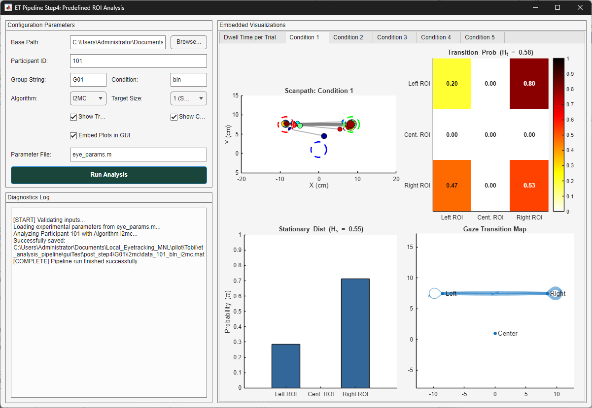

# `gui_4_predefined_roi_analysis.m` Documentation

## Overview

`gui_4_predefined_roi_analysis` is an interactive MATLAB Graphical User Interface (GUI) wrapper and execution engine serving as **Step 4** in the eye tracking analysis pipeline. It provides a split-view graphical environment for configuring participant parameters, executing predefined region of interest (ROI) spatial indexing, computing gaze metrics, and rendering dynamic embedded visualizations.

The function analyzes spatial fixation and pursuit events relative to geometric ROI target boundaries (Targets A [left], B [right], and C [center]). It extracts trial-by-trial dwell times, fixation counts, and pursuit durations, while aggregating condition-level metrics including transition probability matrices, stationary distributions, and gaze transition entropy.

---

## Architecture & Subfunction Summary

The file contains five primary internal functions:

1. **`gui_4_predefined_roi_analysis()`**: Primary UI constructor. Initializes the two-column interface layout, configuration controls, diagnostic logging panel, and dynamic visualization tab group.
2. **`runCallback(...)`**: Event handler for the "Run Analysis" button. Executes pre-run path/file validation, parses subject ranges, executes parameter setup scripts, and triggers processing with progress monitoring.
3. **`process_predefined_roi_analysis(...)`**: Core mathematical and analytical engine. Executes spatial ROI indexing, trial/condition metric calculations, entropy derivations, and visualization plotting.
4. **`logMsg(txt, msg)`**: Helper utility appending timestamped/diagnostic string messages to the UI text area.
5. **`ifelse(cond, trueVal, falseVal)`**: Functional ternary evaluation helper.

---

## Function Signatures

```matlab
% Main UI Launcher
gui_4_predefined_roi_analysis()

% Execution Callback
runCallback(baseFilePath, subjectStr, groupStr, condStr, algoStr, ...
    targetSize, showTrialFigs, showCondFigs, embedInGUI, paramsScript, ...
    txtLog, fig, guiAxes)

% Processing Engine
process_predefined_roi_analysis(baseFilePath, subject_list, EyeParams, ...
    ui_group_str, ui_condition_str, ui_algo_str, ui_targetSize_int, ...
    showTrialFigs, showFigs, embedInGUI, guiAxes, logFcn)
```

---

## User Interface Layout & Control Elements



The GUI figure uses a `uigridlayout` split into two primary panels:
* **Left Panel**: Configuration controls and diagnostic log window.
* **Right Panel**: Interactive visualization area with dynamic `uitabgroup` containers.

### Input Controls Table

| Row | Component | Type | Default Value | Mapped Variable | Description |
| :---: | :--- | :--- | :--- | :--- | :--- |
| **1** | Base Path | `uieditfield` + `uibutton` | `pwd` | `baseFilePath` | Project root folder directory path. |
| **2** | Participant ID | `uieditfield` (text) | `'101'` | `subjectStr` | Subject ID string or array expression (e.g., `'101:105'`). |
| **3** | Group String | `uieditfield` (text) | `'G01'` | `groupStr` | Experimental group tag. |
| **3** | Condition | `uieditfield` (text) | `'bln'` | `condStr` | Condition identifier tag. |
| **4** | Algorithm | `uidropdown` | `'I2MC'` (`'i2mc'`) | `algoStr` | Event classification algorithm (`'i2mc'`, `'mnh'`, `'remo'`). |
| **4** | Target Size | `uidropdown` | `'1 (Small)'` (`1`) | `targetSize` | Target size flag (`1` = normal, `2` = large with `_lg` file suffix). |
| **5** | Show Trial Figs | `uicheckbox` | `true` | `showTrialFigs` | Binary toggle to render trial-level dwell time scatter plots. |
| **5** | Show Condition Figs | `uicheckbox` | `true` | `showCondFigs` | Binary toggle to render condition-level quad-panel figures. |
| **6** | Embed Plots in GUI | `uicheckbox` | `true` | `embedInGUI` | Toggle to render plots inside GUI tabs vs standalone figures. |
| **7** | Parameter File | `uieditfield` (text) | `'eye_params.m'` | `paramsScript` | MATLAB setup script defining `EyeParams` parameters. |
| **8** | Run Button | `uibutton` | `'Run Analysis'` | Action Trigger | Initiates processing pipeline execution. |

---

## Methodology

### 1. Spatial ROI Indexing
Event centroids $(\bar{X}, \bar{Y})$ are evaluated against geometric targets $T \in \{A, B, C\}$ defined in `EyeParams`. Euclidean distance $d_T$ is computed as:

$$d_T = \sqrt{(\bar{X} - X_T)^2 + (\bar{Y} - Y_T)^2}$$

An event is categorized as an ROI hit if $d_T \le r_{\text{target}}$, where target radius $r_{\text{target}} = \frac{\text{targetRadiusInMm}}{10}$ (in cm).

### 2. Stationary Entropy ($H_s$)
Using total dwell times across ROIs ($T \in \{A, C, B\}$), the stationary distribution probability $p_i$ for ROI $i$ is:

$$p_i = \frac{\text{tDwell}_i}{\sum_{k=1}^{3}\text{tDwell}_k}$$

Stationary entropy $H_s$ and normalized relative stationary entropy $H_{s,\text{rel}}$ are computed as:

$$H_s = -\sum_{i=1}^{N} p_i \log_2(p_i)$$

$$H_{s,\text{rel}} = \frac{H_s}{\log_2(N)} \quad \text{where } N = 3 \text{ ROIs}$$

### 3. Transition Entropy ($H_t$)
Given sequence of fixations across ROIs, transition matrix counts $T_{ij}$ yield transition probabilities $p_{ij} = \frac{T_{ij}}{\sum_j T_{ij}}$. Transition entropy $H_t$ and relative transition entropy $H_{t,\text{rel}}$ are computed as:

$$H_t = \sum_{i=1}^{N} p_i \left( -\sum_{j=1}^{N} p_{ij} \log_2(p_{ij}) \right)$$

$$H_{t,	\text{rel}} = \frac{H_t}{\log_2(N)}$$

---

## Diagnostics, Warnings & Sparse Matrix Flags

The pipeline incorporates automated data checks to flag missing data or insufficient sample density during transition matrix construction and entropy estimation.

### 1. Sparse Transition Matrix Check (`sparseSafetyCheck`)
* **Trigger Condition**: Total observed transitions across all ROIs in a condition block is less than double the number of ROIs ($\sum T_{ij} < 2 \times N_{\text{ROIs}} = 6$).
* **Flag Assigned**: `predefinedData.ConditionLevel.(condName).sparseSafetyCheck = 1` (normal density sets this to `0`).
* **Console Alert**:
  ```text
  Check data: sparse transition matrix for condition <c>
  Matrix Sum: <matrixSum>
  ```
* **Impact**: Alerts the researcher that $H_t$ (transition entropy) estimates for that condition block may be unreliable due to low transition counts.

### 2. Insufficient Fixation Alert
* **Trigger Condition**: Total sequence of ROI fixations in a condition is $\le 1$ event ($\text{length}(roiSequence) \le 1$).
* **Flag Assigned**: `predefinedData.ConditionLevel.(condName).sparseSafetyCheck = NaN`.
* **Console Alert**:
  ```text
  Not enough fixations in condition <c> to compute GTE reliably.
  ```
* **Impact**: Transition matrix ($p_{ij}$), stationary distribution ($p_i$), $H_s$, and $H_t$ are populated as `NaN` or empty arrays `[]`.

### 3. File & Structure Validation Warnings
* **Missing File Warning**: If the expected `.mat` file does not exist in `post_step3`, the function logs `WARNING: File not found for <dataTitle>. Skipping participant...` and continues to the next participant.
* **Missing Variable Error**: If neither `bySample_eyeTrialData` nor `eyeTrialData` is present in the loaded MAT file, the function logs `ERROR: No valid eye trial field in <inMatFile>` and skips processing for that subject.

---

## Output Data Structure (`predefinedData`)

Output `.mat` files are saved to `<baseFilePath>\post_step4\<groupStr>\<algoStr>\data_<ID>_<condStr><sizeTag>_<algoStr>.mat`.

```matlab
predefinedData
├── TrialLevel
│   ├── conditionLabel     (50x1 double)
│   ├── fixCountA/B/C      (50x1 double)  - Fixation counts per ROI
│   ├── tDwellA/B/C        (50x1 double)  - Dwell time (seconds) per ROI
│   ├── meanFixDurA/B/C    (50x1 double)  - Mean fixation duration (seconds)
│   ├── mdcA/B/C           (50x1 double)  - Mean distance to center (deg)
│   ├── norm_tDwellA/B/C   (50x1 double)  - Proportional dwell times
│   ├── pursCountA/B/C     (50x1 double)  - Pursuit event counts
│   ├── pursDurA/B/C       (50x1 double)  - Pursuit durations
│   └── roiTotalEngagement (50x1 double)  - Sum of fixations & pursuits
├── ConditionLevel
│   └── c1 .. c5
│       ├── eventMatrix    (Matrix of concatenated blocked events)
│       ├── fixCountA/B/C, tDwellA/B/C, meanFixDurA/B/C, mdcA/B/C
│       ├── p_i            (3x1 double)   - Stationary distribution
│       ├── p_ij           (3x3 double)   - Transition probability matrix
│       ├── Hs / Hs_rel    (double)       - Stationary entropy (bits / relative)
│       └── Ht / Ht_rel    (double)       - Transition entropy (bits / relative)
└── trialBlockedEvents    (1x50 cell array)
```

---

## Visualizations Rendered

When enabled, the embedded layout renders:
1. **Trial-Level Dwell Time**: Scatter plot across 50 trials tracking dwell times in Left (Red), Right (Green), and Center (Blue) ROIs with condition boundary markers.
2. **Condition-Level Quad Panels** (Tabs `Condition 1` through `Condition 5`):
   * **Scanpath Plot**: Spatial gaze trajectory overlay with target ROI tolerance circles.
   * **Transition Matrix Heatmap**: $3 \times 3$ color-mapped probability matrix annotated with values and $H_{t,\text{rel}}$.
   * **Stationary Distribution Bar Chart**: Bar graph of $\pi_i$ with $H_{s,\text{rel}}$.
   * **Transition Digraph**: Node graph showing gaze transitions between Left, Center, and Right nodes with weighted edge widths.
